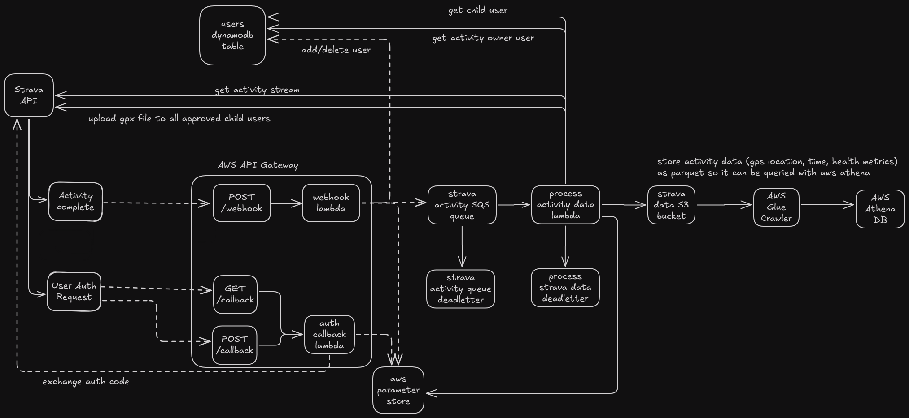

# Exercise API Project

This application sets up infrastructure for downloading and processing data from the Strava API, enabling unique use cases such as activity duplication and data ingestion for analytics.

## Features

### 1. Parent-Child Activity Duplication
This feature allows users to define a list of "child" accounts. If a child's name appears in the activity title of the parent user, the app:
- Downloads the activity stream data from the Strava API.
- Converts it into a GPX file containing latitude, longitude, speed, distance, and cadence data.
- Uploads the activity to the child user's Strava account.

**Personal Use Case:** Automatically sync activities to my dog's Strava profile for easy tracking and sharing.

### 2. Datalake Ingestion for Analytics
The app facilitates advanced analytics by:
- Downloading activity stream data upon activity completion.
- Converting the data into Parquet format.
- Uploading the data to an S3 bucket serving as a data lake.
- Utilizing an AWS Glue crawler to scan and infer the schema.
- Enabling analytic queries through AWS Athena for deeper insights.

### 3. Reproducibility
The entire infrastructure is defined using **Terraform**, making it easily reproducible and manageable across environments.

## Architecture

## Strava API Interaction Workflow

1. **User Authorization**  
   - When a user authorizes the app, the Strava API sends a `GET` request to the `/callback` endpoint.  
   - This request includes a short-lived authorization code, which the app exchanges for a user-specific access token and refresh token.  
   - These tokens are encrypted and securely stored in a DynamoDB table.

2. **Activity Notifications**  
   - When a registered user completes an activity, Strava sends a `GET` request to the `/webhook` endpoint.  
   - The app responds to a verification challenge to confirm webhook registration.  
   - Once verified, Strava sends a `POST` request to the `/webhook` endpoint with detailed activity information, triggering the processing workflows.
